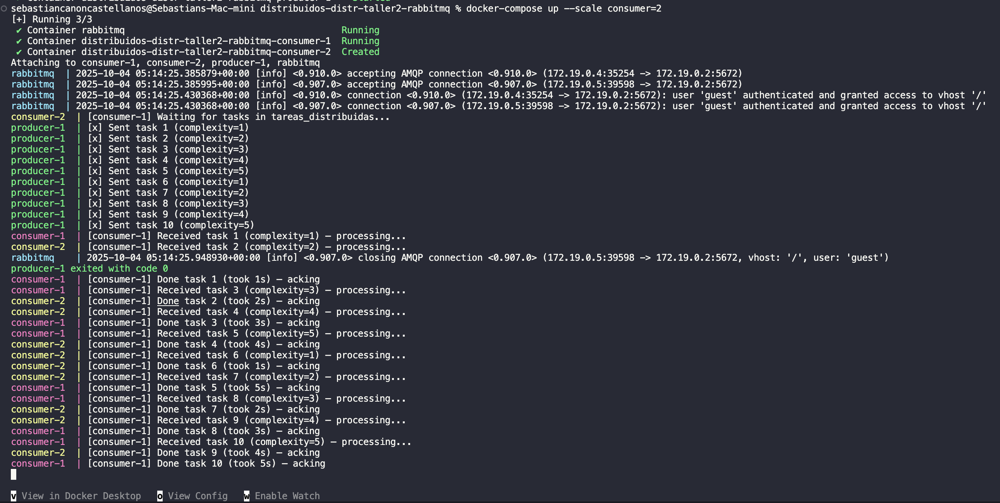
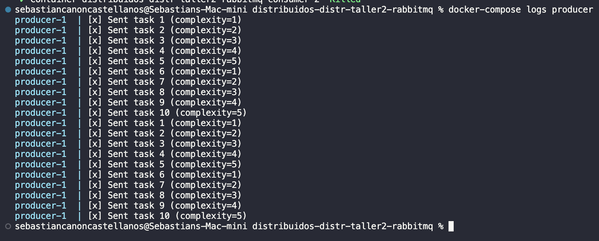
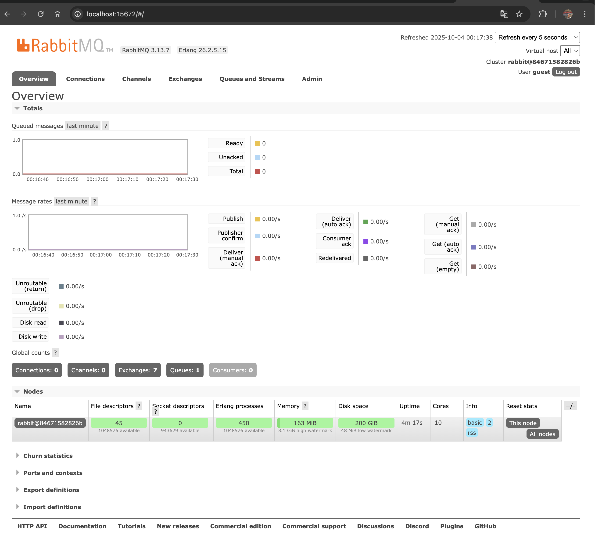
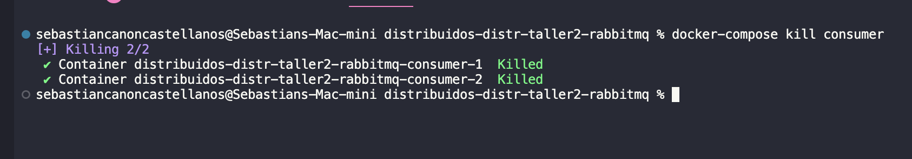

# Distributed Work Queue with RabbitMQ

A simple distributed work queue using RabbitMQ and TypeScript. One producer sends tasks to a queue, multiple workers process them.

## Team Members

- Sebastián Cañón
- Natalia Bernal

## What it does

- Producer sends 10 tasks with different complexity levels (1-5 seconds each)
- Workers consume tasks from the queue and process them 
- Each worker can only handle one task at a time
- If a worker crashes, tasks are redistributed to other workers

## Files

- `producer.ts` - Sends tasks to the queue
- `consumer.ts` - Processes tasks from the queue
- `docker-compose.yml` - Runs everything in containers

## Commands Used

Start and build the system:
```bash
docker-compose up --build -d
```

Scale to 2 consumers:
```bash
docker-compose up --scale consumer=2
```

View producer logs:
```bash
docker-compose logs producer
```

Kill consumer containers:
```bash
docker-compose kill consumer
```

## Evidence Photos

Building and starting containers:

Command: `docker-compose up --build -d`

Scaling consumers to 2 workers:

Command: `docker-compose up --scale consumer=2`

Producer logs showing sent tasks:

Command: `docker-compose logs producer`

RabbitMQ Management Dashboard:

URL: `localhost:15672`

Killing consumer containers:

Command: `docker-compose kill consumer`