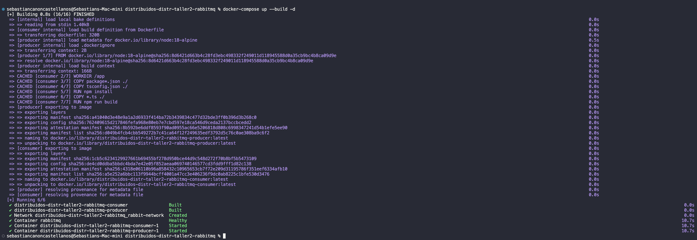

# Cola de Trabajo Distribuida con RabbitMQ

Una cola de trabajo distribuida simple usando RabbitMQ y TypeScript. Un productor envía tareas a una cola, múltiples trabajadores las procesan.

## Integrantes

- Sebastián Cañón
- Natalia Bernal

## Qué hace

- El productor envía 10 tareas con diferentes niveles de complejidad (1-5 segundos cada una)
- Los trabajadores consumen tareas de la cola y las procesan
- Cada trabajador solo puede manejar una tarea a la vez
- Si un trabajador falla, las tareas se redistribuyen a otros trabajadores

## Archivos

- `producer.ts` - Envía tareas a la cola
- `consumer.ts` - Procesa tareas de la cola
- `docker-compose.yml` - Ejecuta todo en contenedores

## Comandos Utilizados

Iniciar y construir el sistema:
```bash
docker-compose up --build -d
```

Escalar a 2 consumidores:
```bash
docker-compose up --scale consumer=2
```

Ver logs del productor:
```bash
docker-compose logs producer
```

Matar contenedores de consumidores:
```bash
docker-compose kill consumer
```

## Evidencias

Construyendo e iniciando contenedores:

Comando: `docker-compose up --build -d`

Escalando consumidores a 2 trabajadores:

Comando: `docker-compose up --scale consumer=2`

Logs del productor mostrando tareas enviadas:

Comando: `docker-compose logs producer`

Panel de administración de RabbitMQ:

URL: `localhost:15672`

Matando contenedores de consumidores:

Comando: `docker-compose kill consumer`